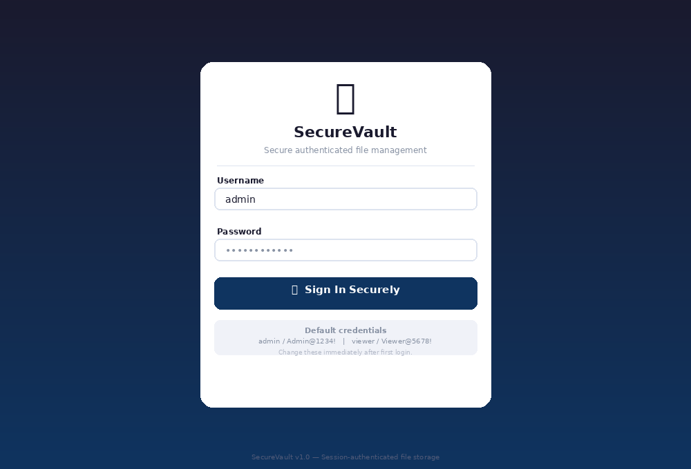
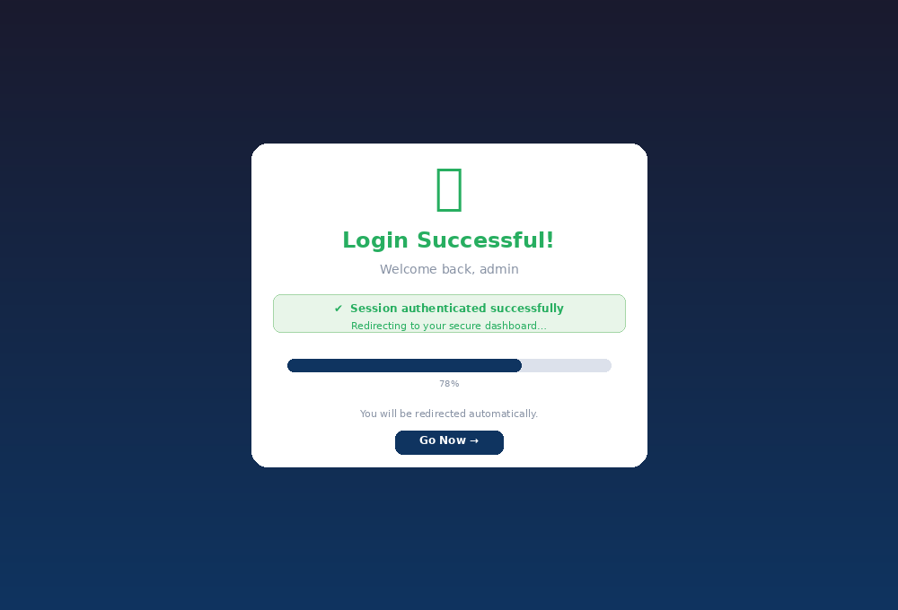
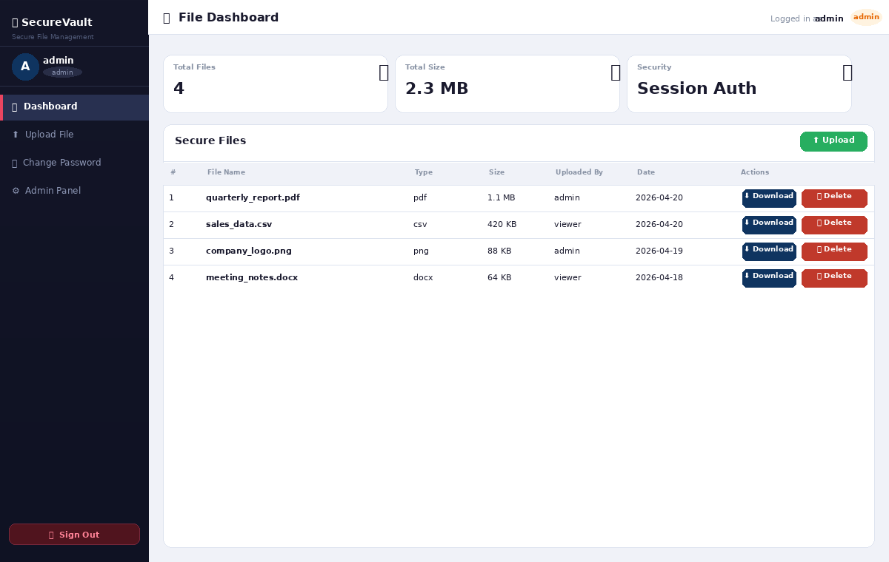
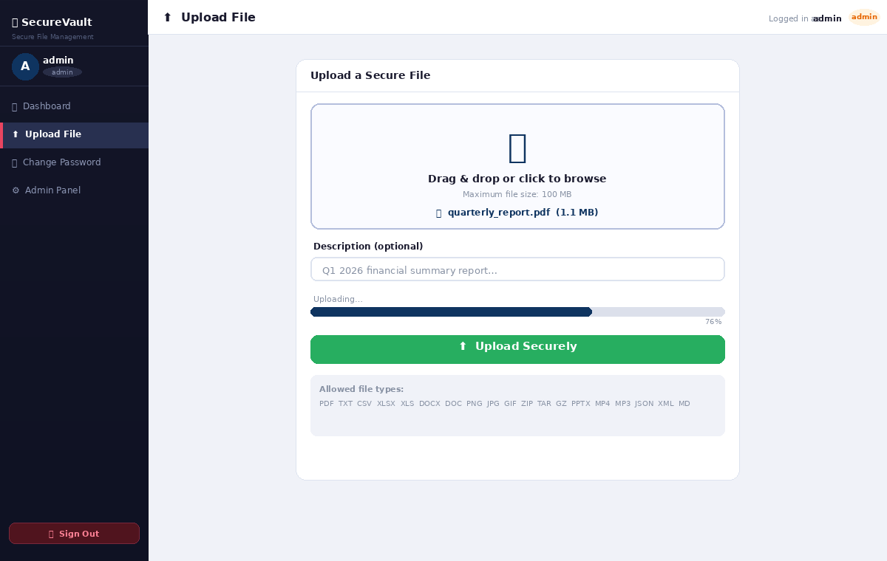
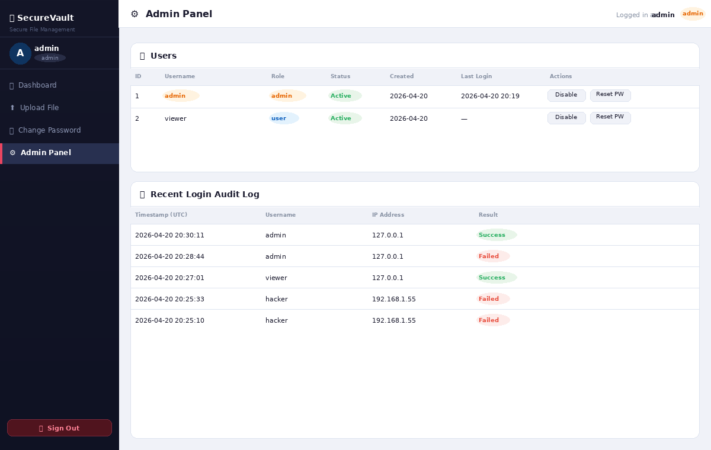
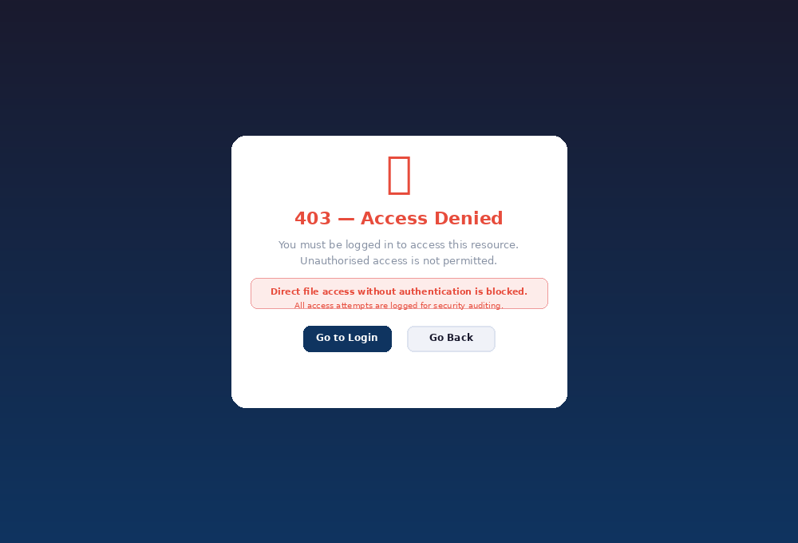

# 🔒 SecureVault — Secure File Downloader

A **production-ready, session-authenticated file management system** built with Python Flask.

---

## Features

| Feature | Detail |
|---|---|
| Authentication | Session-based, HMAC-signed cookies |
| Password security | PBKDF2-SHA256 (Werkzeug, 600 000 iterations) |
| Rate limiting | 5 failed attempts / 5 min per IP |
| Audit logging | Every login attempt logged to SQLite |
| File upload | Drag-and-drop, XHR progress bar, 100 MB cap |
| File download | UUID-named on disk, original name restored |
| File types | 20 allowed MIME types (whitelist) |
| Admin panel | User management, password reset, audit log |
| Role system | `admin` and `user` roles |

---

## Quick Start (Development)

```bash
# 1. Install dependencies
pip install -r requirements.txt

# 2. Set secret key
export SECRET_KEY="$(python -c "import secrets; print(secrets.token_hex(48))")"

# 3. Run
python app.py
# → http://localhost:5000
````

Default credentials (change immediately after first login):

* Admin: `admin` / `Admin@1234!`
* Viewer: `viewer` / `Viewer@5678!`

---

## Production Deployment (Gunicorn + Nginx)

```bash
# 1. Set environment variables
cp .env.example .env
nano .env   # Fill in SECRET_KEY, set FLASK_ENV=production

# 2. Load env vars
export $(grep -v '^#' .env | xargs)

# 3. Launch with Gunicorn (4 workers)
gunicorn -w 4 -b 127.0.0.1:8000 app:app
```

### Nginx config snippet

```nginx
server {
    listen 443 ssl;
    server_name yourdomain.com;

    ssl_certificate     /etc/letsencrypt/live/yourdomain.com/fullchain.pem;
    ssl_certificate_key /etc/letsencrypt/live/yourdomain.com/privkey.pem;

    client_max_body_size 110M;

    location / {
        proxy_pass http://127.0.0.1:8000;
        proxy_set_header Host              $host;
        proxy_set_header X-Real-IP         $remote_addr;
        proxy_set_header X-Forwarded-For   $proxy_add_x_forwarded_for;
        proxy_set_header X-Forwarded-Proto $scheme;
    }
}
```

After enabling HTTPS, set `SESSION_COOKIE_SECURE=True` in `config.py`.

---

## Project Structure

```
secure_file_downloader/
├── app.py
├── config.py
├── database.py
├── requirements.txt
├── .env.example
├── README.md
├── instance/
│   ├── filestore.db
│   └── app.log
├── uploads/
└── templates/
    ├── base.html
    ├── macros.html
    ├── login.html
    ├── dashboard.html
    ├── upload.html
    ├── admin.html
    ├── change_password.html
    └── error.html
```

---

## API Endpoints

| Endpoint      | Method | Auth    | Description        |
| ------------- | ------ | ------- | ------------------ |
| `/api/health` | GET    | None    | Health check       |
| `/api/files`  | GET    | Session | List files as JSON |

---

## Security Checklist

* [x] PBKDF2-SHA256 password hashing
* [x] HMAC-signed session cookies
* [x] HttpOnly + SameSite=Lax cookies
* [x] IP-based rate limiting (5/5 min)
* [x] Full login audit log
* [x] File MIME whitelist
* [x] UUID file renaming (path traversal prevention)
* [x] File ownership enforcement
* [x] POST-only logout (CSRF-safe)
* [x] Admin role guard
* [ ] CSRF tokens — add `Flask-WTF` for full protection
* [ ] TLS/HTTPS — required in production
* [ ] `SESSION_COOKIE_SECURE=True` — enable once HTTPS is set up

---

## 📸 Screenshots

### 🔑 Login Page



### ✅ Login Success



### 📊 Dashboard



### 📤 File Upload



### 🛠️ Admin Panel



### 🚫 Access Denied



---

## 👨‍💻 Author

**Akshat Tiwari**  

- GitHub: https://github.com/akshatcore
- LinkedIn: https://www.linkedin.com/in/akshat-tiwari-8b8b0b312/

---